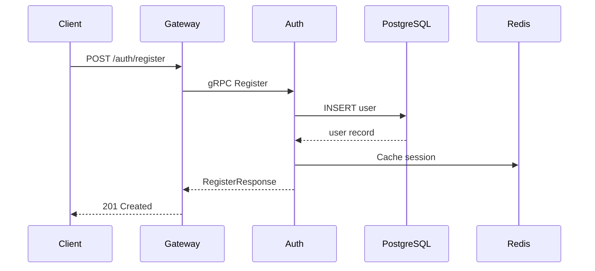
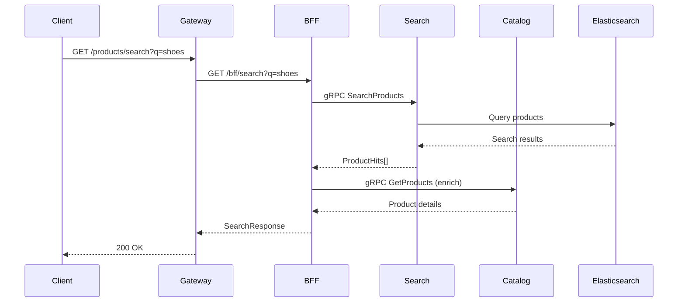
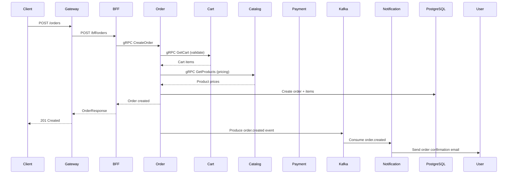
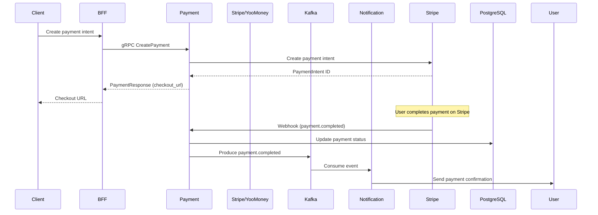
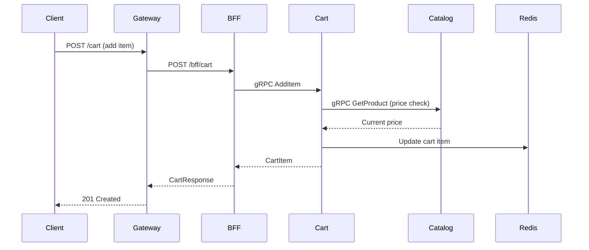

# Services Documentation

Overview of all HyperScale Marketplace microservices, their dependencies, communication patterns, and data flows.

---

## Table of Contents

- [Service Overview](#service-overview)
- [Service Dependency Graph](#service-dependency-graph)
- [Communication Patterns](#communication-patterns)
- [Data Flow Diagrams](#data-flow-diagrams)

---

## Service Overview

### Application Services

| # | Service | Protocol | Ports | Database | Description |
|---|---------|----------|-------|----------|-------------|
| 1 | **auth-service** | gRPC | 50051 (host) | auth_db | Authentication, JWT issuance, password management |
| 2 | **user-service** | gRPC | 50052 (host) | user_db | User profiles, addresses, wishlists |
| 3 | **catalog-service** | HTTP + gRPC | 8084 / 50053 (host) | catalog_db | Products, categories, brands, tags |
| 4 | **cart-service** | HTTP + gRPC | 8081 / 50054 (host) | cart_db + Redis | Shopping cart management |
| 5 | **order-service** | HTTP + gRPC | 8085 / 50055 (host) | order_db | Order lifecycle, status tracking |
| 6 | **payment-service** | HTTP + gRPC | 8082 / 50056 (host) | payment_db | Payment processing (Stripe, YooMoney) |
| 7 | **notification-service** | HTTP + gRPC | 8086 / 50057 (host) | notification_db | Email, push, SMS notifications |
| 8 | **search-service** | HTTP + gRPC | 8087 / 50058 (host) | search_db | Elasticsearch-based product search |
| 9 | **seller-service** | HTTP + gRPC | 8090 / 19090 (host) | seller_db | Seller onboarding and management |
| 10 | **admin-service** | HTTP | 8088 (host) | admin_db | Admin dashboard and management |
| 11 | **bff-service** | HTTP | 8089 (host) | Redis | Backend-for-Frontend aggregation |
| 12 | **gateway** | HTTP | 8080 (host) | — | API Gateway / Load Balancer |

### Infrastructure Services

| Service | Port | Purpose |
|---------|------|---------|
| **postgres** | 15432 | PostgreSQL 16 (10 databases) |
| **redis** | 6379 | Redis 7 (6 DBs for caching) |
| **elasticsearch** | 9200 | Elasticsearch 8.12 (product search) |
| **kibana** | 5601 | Kibana dashboard |
| **kafka** | 9092 | Kafka broker (message streaming) |
| **zookeeper** | 2181 | Zookeeper (Kafka coordination) |
| **mailhog** | 1025/8025 | Dev SMTP server |
| **prometheus** | 9090 | Metrics collection |
| **grafana** | 3000 | Dashboards and alerting |

---

## Service Dependency Graph

### Dependency Map

```
                    ┌─────────────────┐
                    │   External      │
                    │     Client      │
                    └────────┬────────┘
                             │
                    ┌────────▼────────┐
                    │    Gateway      │
                    │   (port 8080)   │
                    └────────┬────────┘
                             │
          ┌──────────────────┼──────────────────┐
          │                  │                  │
   ┌──────▼──────┐   ┌──────▼──────┐   ┌───────▼───────┐
   │ Auth Service │   │  BFF Service│   │ Admin Service │
   │ (gRPC)       │   │  (HTTP)     │   │  (HTTP)       │
   └───┬─────┬────┘   └───┬───┬────┘   └───────────────┘
       │     │             │   │
  ┌────▼─┐  ┌▼────────┐   │   │
  │Postgres│ │Redis    │   │   │
  └────────┘ └─────────┘   │   │
                            │   │
          ┌─────────────────┼───┼─────────────────┐
          │                 │   │                 │
   ┌──────▼──────┐   ┌─────▼──┐   ┌──────────────▼──────┐
   │ Catalog      │   │ Cart   │   │  Order Service       │
   │ Service      │   │ Service│   │  (gRPC + HTTP)       │
   └───┬─────┬────┘   └──┬────┘   └──────┬──────┬────────┘
       │     │            │                │      │
  ┌────▼─┐  ┌▼─────┐  ┌──▼───┐    ┌──────▼──┐  ┌▼──────────┐
  │Postgres│ │Redis │  │Redis │    │Postgres │  │ Kafka     │
  └────────┘ └──────┘  └──────┘    └─────────┘  └─────┬─────┘
                                                        │
                                               ┌────────▼────────┐
                                               │ Notification    │
                                               │ Service         │
                                               └────┬────────┬───┘
                                                    │        │
                                              ┌──────▼┐  ┌───▼─────┐
                                              │Postgres│  │ Mailhog  │
                                              └────────┘  └─────────┘

  Additional Services:
  ┌──────────────┐  ┌──────────────┐  ┌──────────────┐
  │ Search       │  │ Seller       │  │ User         │
  │ Service      │  │ Service      │  │ Service      │
  └───┬──────────┘  └──────┬───────┘  └──────┬───────┘
      │                    │                  │
  ┌───▼─────┐        ┌────▼─────┐       ┌────▼─────┐
  │Elastic-  │        │Postgres  │       │Postgres  │
  │search    │        └──────────┘       └──────────┘
  └──────────┘
```

### Per-Service Dependencies

| Service | Depends On | Used By |
|---------|-----------|---------|
| **auth-service** | PostgreSQL, Redis | Gateway, user-service, bff-service, admin-service |
| **user-service** | PostgreSQL, Redis, auth-service | bff-service |
| **catalog-service** | PostgreSQL, Redis | bff-service, search-service, seller-service, cart-service |
| **cart-service** | PostgreSQL, Redis, catalog-service | bff-service, order-service |
| **order-service** | PostgreSQL, Kafka, cart-service, catalog-service | bff-service, notification-service |
| **payment-service** | PostgreSQL, Kafka | bff-service, notification-service |
| **notification-service** | PostgreSQL, Kafka, Redis | — (event consumer) |
| **search-service** | Elasticsearch, PostgreSQL, catalog-service | bff-service |
| **seller-service** | PostgreSQL, catalog-service, order-service, auth-service | bff-service |
| **admin-service** | PostgreSQL, auth-service | — (admin clients) |
| **bff-service** | Redis, auth, catalog, cart, order, payment, user, seller, search, notification | Gateway |
| **gateway** | auth-service, bff-service | External clients |

---

## Communication Patterns

### 1. Synchronous (gRPC)

Used for direct service-to-service calls requiring low latency.

```
Service A                    Service B
    │                            │
    │  ┌──────────────────────┐  │
    │  │  Stub (generated)    │  │
    │  └──────────┬───────────┘  │
    │             │               │
    │  gRPC Call (protobuf)       │
    │────────────────────────────>│
    │                            │
    │  gRPC Response             │
    │<────────────────────────────│
```

**Services using gRPC:**

| From | To | Method |
|------|-----|--------|
| bff-service | auth-service | `Login`, `Register`, `Refresh` |
| bff-service | user-service | `GetUser`, `UpdateUser` |
| bff-service | catalog-service | `GetProduct`, `ListProducts` |
| bff-service | cart-service | `GetCart`, `AddItem` |
| bff-service | order-service | `CreateOrder`, `GetOrder` |
| bff-service | payment-service | `CreatePayment`, `ConfirmPayment` |
| bff-service | seller-service | `GetSeller`, `GetSellerProducts` |
| bff-service | search-service | `SearchProducts` |
| order-service | cart-service | Get cart before order |
| order-service | catalog-service | Get product details |
| order-service | auth-service | Validate user |
| search-service | catalog-service | Sync product data |
| seller-service | catalog-service | Sync product data |
| seller-service | order-service | Get seller orders |

### 2. Synchronous (HTTP/REST)

Used for public-facing APIs and admin endpoints.

**Services with HTTP endpoints:**

| Service | Port | Endpoints |
|---------|------|-----------|
| catalog-service | 8084 | Products CRUD, Categories, Brands, Tags |
| cart-service | 8081 | Cart operations |
| order-service | 8085 | Order operations |
| payment-service | 8082 | Payment operations, webhooks |
| notification-service | 8086 | Notification operations |
| search-service | 8087 | Search operations |
| seller-service | 8090 | Seller management |
| admin-service | 8088 | Admin dashboard |
| bff-service | 8089 | Aggregation endpoints |
| gateway | 8080 | Public API gateway |

### 3. Asynchronous (Kafka)

Used for event-driven communication and eventual consistency.

```
Producer                    Kafka                    Consumer
  │                           │                          │
  │  Produce event            │                          │
  │  (order.created)          │                          │
  │──────────────────────────>│                          │
  │                           │  Store & replicate       │
  │                           │                          │
  │                           │  Deliver event           │
  │                           │─────────────────────────>│
  │                           │                          │
  │                           │  Acknowledge             │
  │                           │<─────────────────────────│
```

**Kafka Topics:**

| Topic | Producer | Consumers | Schema |
|-------|----------|-----------|--------|
| `order.created` | order-service | notification-service | OrderCreatedEvent |
| `order.status_changed` | order-service | notification-service | OrderStatusChangedEvent |
| `payment.completed` | payment-service | notification-service | PaymentCompletedEvent |
| `payment.failed` | payment-service | notification-service | PaymentFailedEvent |
| `marketplace-events` | Various | Various | Generic event |

---

## Data Flow Diagrams

### 1. User Registration Flow



### 2. Product Search Flow



### 3. Order Creation Flow



### 4. Payment Processing Flow



### 5. Cart Management Flow



---

## Related Documentation

- [Gateway Documentation](gateway.md) — API Gateway details
- [Authentication](authentication.md) — Auth flow details
- [gRPC API Reference](grpc-api.md) — All proto definitions
- [Kafka Events](kafka.md) — Event streaming details
- [Deployment Guide](deployment.md) — Service deployment
